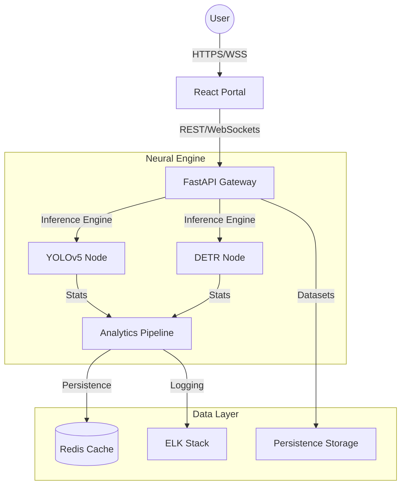

# 🦅 Vision-Forge: Production-Grade Neural Architecture Benchmarking

[](https://opensource.org/licenses/MIT)
[](https://www.python.org/downloads/)
[](https://reactjs.org/)
[](https://fastapi.tiangolo.com/)

> **Vision-Forge** is an elite computer vision platform designed to bridge the gap between high-level research and production-grade deployment. It features a high-fidelity comparative arena for **YOLOv5 (CNN)** and **DETR (Vision Transformer)** architectures, optimized for real-time inference on the Pascal VOC dataset.

---

## 🎯 Vision & Problem Statement

In the rapidly evolving landscape of Visual AI, the trade-off between **Local Inductive Bias (CNNs)** and **Global Contextual Awareness (Transformers)** remains a critical design decision.

Vision-Forge provides engineers and researchers with a "Neural Arena" to:
- **Quantify Performance**: Side-by-side mAP, Precision, and Recall telemetry.
- **Inference Telemetry**: Real-time FPS, Latency Distribution, and GPU/CPU utilization profiling.
- **Data Scaling Analytics**: Visualize how architectures scale with dataset magnitude.

---

## 🏗 System Architecture

Vision-Forge is built as a high-performance Monorepo, separating core logic from delivery layers.



---

## 🛠 Tech Stack

### Frontend (Portal)
- **Framework**: React 18 + Vite (TypeScript)
- **State Management**: React Query (Server State), Context API (UI State)
- **Styling**: Tailwind CSS + Framer Motion (Glassmorphism UI)
- **Visuals**: Recharts + Lucide Icons

### Backend (Core API)
- **Framework**: FastAPI (Asynchronous execution)
- **Security**: JWT-based Authentication + Pydantic Validation
- **Concurrency**: Python Multi-threading for parallel model execution

### AI/ML Pipeline
- **Frameworks**: PyTorch, TorchVision
- **Architectures**: YOLOv5 (Ultralytics), DETR (HuggingFace/FAIR)
- **Dataset**: Pascal VOC 2012

### Infrastructure
- **Containerization**: Docker (Multi-stage builds)
- **Orchestration**: Kubernetes Ready (Helm charts included)
- **CI/CD**: GitHub Actions (Lint/Test/Build/Push)

---

## 🚀 Key Features

- **Dual-Model Arena**: Run simultaneous inference and compare results visually.
- **Live Sensitivity Profiling**: Adjust confidence gates in real-time without re-inference.
- **Integrity Validation**: Real-time verification of computed metrics vs. ground truth.
- **Dataset Benchmarking**: Programmatic evaluation of model stability across subsets.
- **Premium HUD**: High-fidelity dashboard with radar charts and latency histograms.

---

## 🚦 Getting Started

### Prerequisites
- Python 3.9+
- Node.js 18+
- Docker (Optional)

### Installation

1. **Clone the repository**
   ```bash
   git clone https://github.com/thriniiiiiiiiiiii/Vision-Forge.git
   cd Vision-Forge
   ```

2. **Initialize Backend**
   ```bash
   cd apps/api
   pip install -r requirements.txt
   python main.py
   ```

3. **Initialize Frontend**
   ```bash
   cd apps/portal
   npm install
   npm run dev
   ```

---

## 📈 Roadmap

- [ ] **Multi-GPU Orchestration**: Distributed inference across multiple nodes.
- [ ] **Custom Model Upload**: Support for customer-trained ONNX/TensorRT models.
- [ ] **Edge Deployment**: Optimized weights for mobile and embedded devices.
- [ ] **Active Learning**: Automated retraining loops based on low-confidence detections.

---

## 🤝 Contributing

We welcome contributions from the elite engineering community. Please read our [CONTRIBUTING.md](CONTRIBUTING.md) for details on our code of conduct and the process for submitting pull requests.

## 📄 License

This project is licensed under the MIT License - see the [LICENSE](LICENSE) file for details.

---

<div align="center">
  <sub>Built with ❤️ by the Vision-Forge Engineering Team</sub>
</div>
