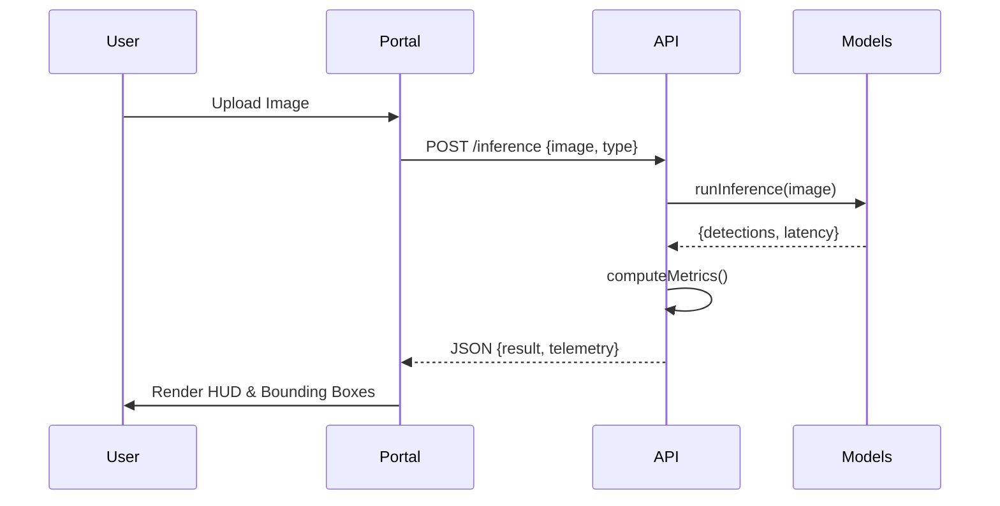

# Architecture Design: Vision-Forge

Vision-Forge is engineered for high-availability, low-latency AI inference and comparative analysis. This document outlines the core architectural principles and data flow.

## Design Philosophy

1.  **Decoupling Architecture**: The UI is a thin "Portal" layer, while the "Neural Engine" handles heavy lifting.
2.  **Concurrency by Default**: Model inference is treated as an asynchronous task to prevent UI blocking.
3.  **Observability**: Every inference event is logged with detailed telemetry (latency, confidence, class distribution).

## Component Breakdown

### 1. Delivery Layer (Portal)
- **Type**: Single Page Application (SPA).
- **Core Unit**: `DetectionPlayground.tsx` orchestrates user intent.
- **Data Fetching**: Uses `useQuery` for optimistic updates and caching.

### 2. Logic Layer (API)
- **Type**: Asynchronous REST API.
- **Framework**: FastAPI.
- **Model Isolation**: Models are loaded into memory once and shared across requests using a singleton pattern.

### 3. Execution Layer (Core ML)
- **Engine**: PyTorch.
- **Optimization**: CUDA-enabled (if available) with automated fallback to CPU.
- **Data Flow**: Base64 image -> Tensor -> Inference -> JSON Result -> UI.

## Data Flow: Inference Request

1.  **Ingress**: User uploads image via Portal.
2.  **Transformation**: Portal compresses and sends Base64 payload to API.
3.  **Preprocessing**: API decodes image and applies architectural-specific transforms (normalization, resizing).
4.  **Parallel Execution**: If "Compare" mode is active, two threads are spawned for YOLO and DETR.
5.  **Aggregation**: Results are merged with telemetry data.
6.  **Egress**: JSON payload returned to Portal for rendering.

## Telemetry System

The analytics engine computes metrics in two phases:
1.  **Live (Volatile)**: FPS and Latency computed on the fly.
2.  **Batch (Persisted)**: mAP and PR Curves computed against ground truth datasets.

