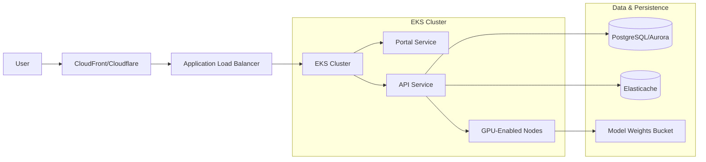

# Infrastructure & Deployment: Vision-Forge

Vision-Forge is designed to scale from a local developer machine to a global distributed cloud environment.

## ☁️ Cloud Reference Architecture

## 🐳 Containerization Strategy

We use multi-stage Docker builds to minimize image size and attack surface.

- **Portal**: Build step (Node) -> Serving step (Nginx).
- **API**: Build step (Python) -> Production Serving (Uvicorn).

### Docker Compose (Local Dev)
The `infrastructure/docker/docker-compose.yml` provides a one-command setup for the entire stack including:
- API (Port 8000)
- Portal (Port 80)
- Redis (Session/Cache)

## ☸️ Orchestration (Kubernetes)

For production, we recommend deploying via Helm. Manifests are located in `infrastructure/k8s/`:
- **HorizontalPodAutoscaler**: Scales API pods based on GPU utilization.
- **Ingress-Nginx**: Handles SSL termination and path routing.

## 🛤 CI/CD Pipeline

Targeting 100% automation of the delivery lifecycle.

1.  **CI (GitHub Actions)**:
    - Code Linting (ESLint, Flake8)
    - Unit Testing (Vitest, Pytest)
    - Image Build & Push to ECR/GHCR
2.  **CD (ArgoCD)**:
    - Observes Git repository for tag changes.
    - Synchronizes state to K8S cluster.

## 🚄 Scalability Metrics

- **Vertical**: Increase RAM/VRAM to handle larger batch sizes.
- **Horizontal**: Scale API instances behind LB.
- **Database**: Read-replicas for metrics querying.
- **CDN**: Cache static assets and model weights at the edge.
